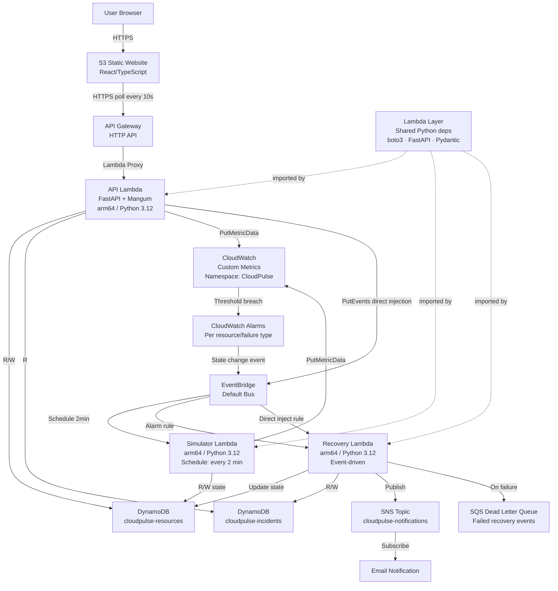
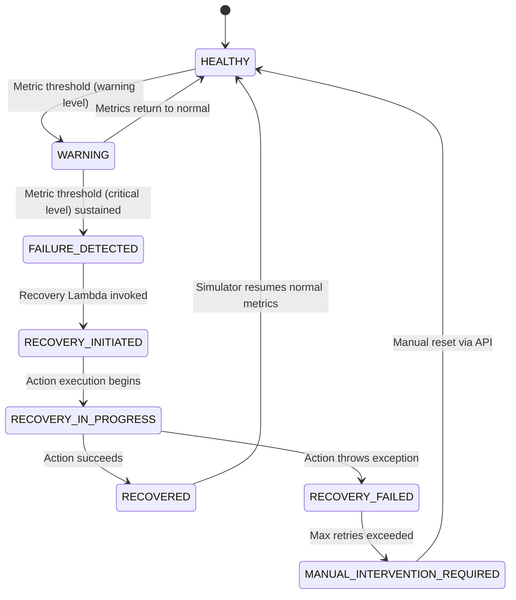

# ARCHITECTURE.md
## CloudPulse — Autonomous Cloud Reliability and Self-Healing Simulator

**Version:** 2.0 (Production Structure)
**Course:** BCSE355L – Cloud Architecture Design | Fall 2026-2027
**Last Updated:** 2026-09-08

---

## 1. System Overview

CloudPulse is a serverless, event-driven simulation platform demonstrating:
- Autonomous failure detection via CloudWatch alarms
- Event-driven recovery via EventBridge rules
- State-machine-driven recovery actions
- Incident persistence in DynamoDB
- Real-time dashboard via React polling API Gateway

**Critical constraint:** CloudPulse simulates failures through DynamoDB state changes on virtual resource records. It does NOT interact with, stop, or modify any real AWS compute or database infrastructure.

---

## 2. Folder Responsibilities

| Directory | Responsibility | Can import from |
|---|---|---|
| `backend/` | Pure FastAPI app. No Lambda code. No Mangum. Business logic, models, repositories, services. | Nothing outside `backend/` |
| `lambda/` | Thin Lambda entry points only. Imports from `backend/` (via Lambda Layer) and AWS SDK. | `backend/` (as Layer), `aws-sdk` |
| `infrastructure/` | SAM template defining all AWS resources. IAM roles. samconfig. | None |
| `frontend/` | React/TypeScript dashboard. Talks only to API Gateway. | None |
| `tests/` | Integration + E2E tests. Unit tests live in `backend/tests/`. | `backend/`, AWS SDK |
| `docs/` | Architecture, ADRs, runbooks, diagrams. | None |
| `scripts/` | One-off developer utilities (seed, deploy frontend, reset). | `backend/` (optional) |

---

## 3. Key Architectural Decision: FastAPI + Mangum

**Decision:** FastAPI runs in Lambda via the Mangum ASGI adapter.

**Why Mangum?**
- API Gateway (HTTP API) is an explicit project requirement.
- Mangum translates Lambda proxy events (API Gateway format) to standard ASGI requests.
- FastAPI has zero awareness it is running in Lambda — the same `app` object runs locally via `uvicorn`.
- This separation makes local development and unit testing with `TestClient` straightforward and fast.
- Alternative (Lambda Function URL) was rejected because API Gateway is required.

**Architecture:** `backend/app/main.py` exports a plain `app: FastAPI` object. `lambda/api/handler.py` imports it and wraps it: `handler = Mangum(app)`.

**Trade-off accepted:** FastAPI + Mangum adds ~1-2 seconds to Lambda cold starts. This is acceptable for an academic demo. If sub-500ms p99 latency were required, we would use a plain dict-returning handler.

---

## 4. Full Architecture Diagram



---

## 5. Data Flow: Autonomous Failure-to-Recovery

```
Step 1: EventBridge scheduler fires every 2 minutes
Step 2: Simulator Lambda reads all resource states from DynamoDB
Step 3: Simulator applies random metric walk, updates DynamoDB
Step 4: Simulator publishes metrics to CloudWatch (namespace: CloudPulse)
Step 5: CloudWatch alarm evaluates metric against threshold (2 x 1-min periods)
Step 6: Alarm → ALARM state → EventBridge state-change event emitted
Step 7: EventBridge rule: source=aws.cloudwatch, alarmName prefix=cloudpulse-
Step 8: Recovery Lambda invoked with alarm event
Step 9: Recovery Lambda parses alarm name → resource_id + failure_type
Step 10: DynamoDB conditional update: FAILURE_DETECTED → RECOVERY_INITIATED
         (If condition fails → resource already recovering → skip, idempotent)
Step 11: Incident record created in DynamoDB
Step 12: Resource state → RECOVERY_IN_PROGRESS
Step 13: Simulated recovery action executes (sleep + state transition)
Step 14: Resource state → RECOVERED (or RECOVERY_FAILED)
Step 15: Incident record closed
Step 16: SNS notification published
Step 17: Frontend polls GET /resources → sees RECOVERED state
```

---

## 6. Data Flow: Manual Failure Injection (Demo)

```
Step 1: User clicks "Inject Failure" on dashboard
Step 2: Frontend → POST /simulate/inject → API Gateway → API Lambda
Step 3: API Lambda validates resourceId + failureType
Step 4: SimulationService sets metric values to threshold-breaching levels
Step 5: DynamoDB updated: state → FAILURE_DETECTED
Step 6: API Lambda publishes CloudWatch metric spike
Step 7: API Lambda puts EventBridge event (source: cloudpulse.simulator)
        ↳ This bypasses the 1-5 minute CloudWatch alarm evaluation delay
Step 8: Recovery Lambda invoked immediately via EventBridge rule
Step 9: Normal recovery flow (Steps 9-17 above)
```

---

## 7. AWS Services Design

### 7.1 API Gateway (HTTP API)
| Property | Value |
|---|---|
| Type | HTTP API (not REST API) |
| Stage | `dev` or `prod` |
| Auth | None (public, academic demo) |
| CORS | Configured for S3 website origin |
| Logging | Access logs → CloudWatch (`/aws/apigateway/cloudpulse-{env}`) |
| Throttling | Default (10,000 rps) — not tuned for academic use |
| Routes | `ANY /{proxy+}` → API Lambda |

HTTP API chosen over REST API: lower cost ($1/million vs $3.5/million requests), lower latency, simpler configuration.

### 7.2 Lambda Functions

| Function | Trigger | Memory | Timeout | Arch |
|---|---|---|---|---|
| `cloudpulse-api` | API Gateway HTTP API | 256 MB | 30s | arm64 |
| `cloudpulse-simulator` | EventBridge Schedule (2 min) | 256 MB | 60s | arm64 |
| `cloudpulse-recovery` | EventBridge Rule (alarm + inject) | 256 MB | 60s | arm64 |

**arm64 (Graviton2):** ~20% cheaper per GB-second than x86_64 for Python workloads. No code changes needed.

**Lambda Layer:** All three functions share a Lambda Layer containing `backend/` Python package (FastAPI, Pydantic, boto3). This avoids packaging the same 50MB of dependencies three times.

### 7.3 DynamoDB

| Table | PK | Billing | Table Class |
|---|---|---|---|
| `cloudpulse-resources-{env}` | `resource_id` (S) | On-demand | STANDARD_INFREQUENT_ACCESS |
| `cloudpulse-incidents-{env}` | `incident_id` (S) | On-demand | STANDARD_INFREQUENT_ACCESS |

- **On-demand billing:** No provisioned capacity to manage. Free tier: 25 GB + 200M requests/month.
- **STANDARD_INFREQUENT_ACCESS:** Lower storage cost for data that is read infrequently.
- **No TTL on incidents:** For the academic demo, incidents are retained indefinitely. A TTL could be added for production.
- **Strongly consistent reads** used in recovery Lambda for state-critical reads.
- **Conditional writes** used for idempotency (conditional update on `current_state`).

### 7.4 CloudWatch

| Namespace | Dimensions | Metrics |
|---|---|---|
| `CloudPulse` | `ResourceId`, `ResourceType` | `CPUUtilization`, `MemoryUtilization`, `StorageUtilization`, `NetworkLatency` |

- **Custom metrics:** Published by Simulator Lambda. Not standard EC2/RDS metrics.
- **Free tier:** 10 custom metrics, 10 alarms free/month. This project uses ~16 metrics (4 resources × 4 metrics) and 5 alarms. Slightly over free tier.
- **Cost estimate:** ~$0.30/month for extra metrics + alarms. Negligible.
- **Alarm evaluation:** Period=60s, EvaluationPeriods=2 → alarm fires after 2 minutes of sustained breach.
- **Log groups:** All Lambda and API Gateway log groups are created explicitly with 7-day retention to prevent unbounded storage cost.

### 7.5 EventBridge

| Rule | Pattern | Target |
|---|---|---|
| `cloudpulse-heartbeat` | Schedule: `rate(2 minutes)` | Simulator Lambda |
| `cloudpulse-alarm-rule` | source: `aws.cloudwatch`, alarmName prefix: `cloudpulse-` | Recovery Lambda |
| `cloudpulse-inject-rule` | source: `cloudpulse.simulator`, detail-type: `FailureInjected` | Recovery Lambda |

- **Default Event Bus:** Used for CloudWatch alarm events and custom events. No custom bus needed at this scale.
- **Free tier:** 1M events/month free. Project generates ~21,600 scheduler events/month. Well within free tier.

### 7.6 SNS

| Property | Value |
|---|---|
| Topic | `cloudpulse-notifications-{env}` |
| Protocol | email (optional) |
| Publishers | Recovery Lambda only |

- Email subscription is optional (no subscription if `NotificationEmail` param is empty).
- Free tier: 1M notifications/month, 1,000 email notifications/month.

### 7.7 S3

| Bucket | Purpose | Access |
|---|---|---|
| `cloudpulse-frontend-{accountId}-{env}` | React SPA hosting | Public read (website hosting) |

- S3 static website hosting (HTTP only, no HTTPS without CloudFront).
- `index.html` is the error document for SPA routing support.

### 7.8 IAM

Three Lambda roles, each with minimum required permissions:

| Role | DynamoDB | CloudWatch | EventBridge | SNS | SQS |
|---|---|---|---|---|---|
| `cloudpulse-api-role` | R+W resources, R incidents | PutMetricData (CloudPulse ns only) | PutEvents | — | — |
| `cloudpulse-simulator-role` | R+W resources | PutMetricData (CloudPulse ns only) | — | — | — |
| `cloudpulse-recovery-role` | R+W resources+incidents | — | — | Publish (topic only) | SendMessage (DLQ only) |

**CloudWatch PutMetricData** is scoped to namespace `CloudPulse` via a condition key.
No function has `*` on any resource except CloudWatch PutMetricData (which has no resource ARN support — namespace condition is the only available scope control).

---

## 8. Recovery State Machine



---

## 9. Alarm Naming Convention

Alarms are named: `cloudpulse-{ResourceId}-{FailureType}`

Examples:
- `cloudpulse-VM-001-HIGH_CPU`
- `cloudpulse-API-001-SERVICE_FAILURE`
- `cloudpulse-STORAGE-001-STORAGE_EXHAUSTION`

The Recovery Lambda parses this name to extract `resource_id` and `failure_type` without any additional metadata lookup.

---

## 10. Open ADRs

| ADR | Decision | Status |
|---|---|---|
| ADR-001 | IaC: AWS SAM | Accepted |
| ADR-002 | Recovery trigger: EventBridge | Accepted |
| ADR-003 | DynamoDB: multi-table | Accepted |
| ADR-004 | Frontend: S3 only | Accepted |
| ADR-005 | Real-time: polling | Accepted |
| ADR-006 | API: API Gateway + Mangum | Accepted |

