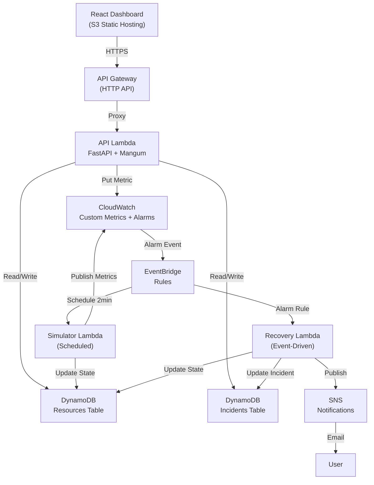

# ARCHITECTURE.md
## CloudPulse: Autonomous Cloud Reliability and Self-Healing Simulator

**Version:** 1.0  
**Course:** BCSE355L – Cloud Architecture Design | Fall 2026-2027

---

## 1. System Overview

CloudPulse is a serverless, event-driven simulation platform that demonstrates how modern cloud reliability engineering works. It simulates virtual resources, injects failures, detects them via metric thresholds, and autonomously executes recovery actions — all while persisting incident data and notifying stakeholders.

The word "simulator" is deliberate: no real compute or database infrastructure is harmed. State is maintained in DynamoDB, and all "failures" and "recoveries" are state-machine transitions on logical resource records.

---

## 2. High-Level Architecture

```
┌─────────────────────────────────────────────────────────────────┐
│                        FRONTEND (React/TS)                      │
│                   Hosted on Amazon S3 + CloudFront*             │
│   Dashboard | Resource View | Incident Log | Metrics Charts      │
└────────────────────────────┬────────────────────────────────────┘
                             │ HTTPS
                             ▼
┌─────────────────────────────────────────────────────────────────┐
│                    Amazon API Gateway (HTTP API)                 │
│              Routes: /resources  /incidents  /simulate           │
└────────────────────────────┬────────────────────────────────────┘
                             │ Lambda Proxy
                             ▼
┌─────────────────────────────────────────────────────────────────┐
│               CloudPulse API Lambda (Python 3.12)               │
│              FastAPI + Mangum adapter                           │
│  - Resource CRUD                                                │
│  - Incident management                                          │
│  - Failure injection (simulation trigger)                       │
└──────┬─────────────────────┬────────────────────────────────────┘
       │                     │
       ▼                     ▼
┌─────────────┐    ┌──────────────────────────────────────────────┐
│  DynamoDB   │    │             Amazon CloudWatch                 │
│ Resources   │    │  Custom Metrics (CPU, memory, latency, etc.) │
│ Incidents   │    │  Alarms → EventBridge Events                  │
└─────────────┘    └──────────────────┬───────────────────────────┘
                                      │ Alarm state change event
                                      ▼
                   ┌──────────────────────────────────────────────┐
                   │           Amazon EventBridge                  │
                   │  Rule: CloudWatch Alarm → Recovery Lambda    │
                   │  Rule: Scheduled heartbeat → Simulator Lambda│
                   └──────────────────┬───────────────────────────┘
                                      │
                     ┌────────────────┴──────────────────┐
                     ▼                                   ▼
        ┌────────────────────────┐      ┌────────────────────────┐
        │  Recovery Lambda       │      │  Simulator Lambda       │
        │  (Python 3.12)        │      │  (Python 3.12)         │
        │  - Determines recovery │      │  - Runs on schedule    │
        │    action by failure   │      │  - Updates resource     │
        │    type               │      │    metrics randomly     │
        │  - Updates DynamoDB   │      │  - Publishes CloudWatch │
        │  - Publishes metrics  │      │    custom metrics       │
        └────────┬───────────────┘      └────────────────────────┘
                 │
                 ▼
        ┌────────────────┐
        │  Amazon SNS    │
        │  Notifications │
        │  (email/SMS)   │
        └────────────────┘

* CloudFront is optional; S3 static hosting is sufficient for academic demo.
```

---

## 3. Component Descriptions

### 3.1 API Lambda (`cloudpulse-api`)
- Entry point for all frontend requests.
- FastAPI application, wrapped with Mangum for Lambda compatibility.
- Responsibilities:
  - List and get virtual resources
  - List, get, and acknowledge incidents
  - Trigger a simulated failure on a specific resource
  - Return CloudWatch metric summaries for the dashboard

### 3.2 Simulator Lambda (`cloudpulse-simulator`)
- Invoked on a schedule via EventBridge (e.g., every 2 minutes).
- Randomly adjusts metric values for each virtual resource.
- Publishes custom CloudWatch metrics under the `CloudPulse` namespace.
- Occasionally simulates threshold breaches to trigger the alarm/recovery flow.
- Writes updated resource state back to DynamoDB.

### 3.3 Recovery Lambda (`cloudpulse-recovery`)
- Triggered by EventBridge when a CloudWatch alarm enters ALARM state.
- Also triggerable manually via API for demo purposes.
- Determines recovery action based on failure type:
  - High CPU → simulated scale-out (state update)
  - Service Failure → simulated restart (state update + delay)
  - Storage Exhaustion → simulated cleanup (state update)
  - Network Latency → simulated reroute (state update)
- Updates resource state in DynamoDB through the recovery state machine.
- Creates/updates incident records.
- Publishes SNS notification on recovery completion or failure.

### 3.4 DynamoDB Tables
| Table | PK | SK | Purpose |
|---|---|---|---|
| `cloudpulse-resources` | `resourceId` | — | Virtual resource state |
| `cloudpulse-incidents` | `incidentId` | `resourceId` | Incident log |

### 3.5 CloudWatch Metrics & Alarms
- Custom namespace: `CloudPulse`
- Dimensions: `ResourceId`, `ResourceType`
- Metrics: `CPUUtilization`, `MemoryUtilization`, `StorageUtilization`, `NetworkLatency`, `HealthScore`
- Alarms defined per resource and per failure type, routing to EventBridge.

### 3.6 EventBridge Rules
| Rule | Source | Target |
|---|---|---|
| `cloudpulse-alarm-rule` | CloudWatch Alarm state change | Recovery Lambda |
| `cloudpulse-heartbeat-rule` | Schedule (every 2 min) | Simulator Lambda |

### 3.7 SNS Topic (`cloudpulse-notifications`)
- Subscriptions: email (configured via environment variable)
- Messages sent on: failure detected, recovery completed, recovery failed, manual intervention required.

### 3.8 S3 Buckets
| Bucket | Purpose |
|---|---|
| `cloudpulse-frontend-{account}` | Static React frontend hosting |
| `cloudpulse-reports-{account}` | (Optional) Incident report exports |

---

## 4. Data Flow: Failure Detection & Recovery

```
1. Simulator Lambda updates resource metrics in DynamoDB
2. Simulator Lambda publishes metrics to CloudWatch
3. CloudWatch Alarm threshold breached → ALARM state
4. CloudWatch emits event to EventBridge
5. EventBridge rule matches → invokes Recovery Lambda
6. Recovery Lambda:
   a. Reads resource state from DynamoDB
   b. Sets state: RECOVERY_INITIATED → RECOVERY_IN_PROGRESS
   c. Performs simulated recovery action
   d. On success: sets state RECOVERED, creates/closes incident
   e. Publishes SNS notification
7. Frontend polls API → displays updated state & incident
```

---

## 5. Data Flow: Manual Failure Injection

```
1. User clicks "Inject Failure" on dashboard
2. Frontend → POST /simulate/inject → API Gateway → API Lambda
3. API Lambda updates resource state in DynamoDB (HEALTHY → FAILURE_DETECTED)
4. API Lambda publishes CloudWatch metric with threshold-breaching value
5. (Optional) API Lambda directly puts event on EventBridge
6. Recovery Lambda triggered → normal recovery flow
```

---

## 6. Security Architecture

- **API Gateway**: CORS configured for frontend domain only.
- **IAM**: Each Lambda has its own role. No shared admin roles.
- **DynamoDB**: Accessed only by Lambda roles (not public).
- **SNS**: Publish only from Recovery Lambda role.
- **S3**: Frontend bucket is public-read for static hosting. Reports bucket is private.
- **Secrets**: No credentials in code. Environment variables set in SAM template (values from SSM Parameter Store or SAM deploy-time params).

---

## 7. Constraints & Scaling Notes

- DynamoDB: On-demand billing. No provisioned capacity. Free tier covers 25 GB and 200M requests/month — sufficient for academic use.
- Lambda: Free tier covers 1M invocations/month. Simulator runs every 2 minutes = ~21,600 invocations/month — well within free tier.
- CloudWatch: Free tier covers 10 custom metrics, 10 alarms. Project uses ~20 metrics (5 resources × 4 metrics). May slightly exceed free tier; cost is negligible (<$1/month).
- EventBridge: 1M events/month free. Project generates ~21,600 events/month from scheduler.
- SNS: 1M notifications/month free. Academic usage far below this.

---

## 8. Architecture Diagram (Mermaid)



---

## 9. Architectural Decision Records (ADRs)

ADRs are stored in `docs/adr/`. Each decision that affects the architecture must have an ADR. See `docs/adr/README.md` for the template.

Key open decisions (to be decided before Phase 2):
- ADR-001: SAM vs CDK for IaC
- ADR-002: EventBridge vs direct Lambda invocation for recovery triggering
- ADR-003: DynamoDB single-table vs multi-table design
- ADR-004: CloudFront vs plain S3 for frontend hosting
- ADR-005: Polling vs WebSocket/SSE for dashboard real-time updates
- ADR-006: Mangum vs Lambda Function URL (no API Gateway) for API serving

