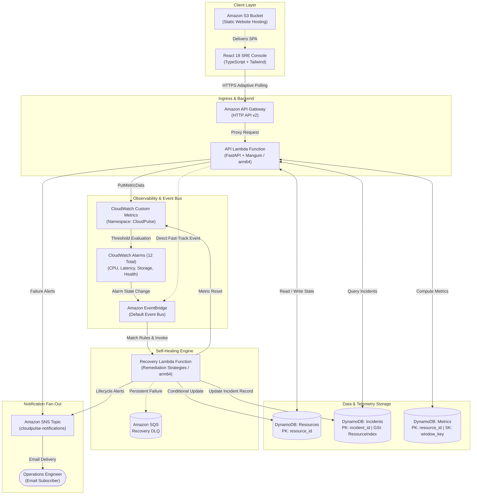

# ☁️ CloudPulse

**Autonomous Cloud Reliability and Self-Healing Simulator Using AWS Serverless Architecture**

> **Course:** BCSE355L – Cloud Architecture Design | Fall 2026-2027  
> **Milestone:** Project Review 2 (Release Candidate)  
> **Verification:** 367 Backend Tests (100% Pass) | 49 Frontend Tests (100% Pass) | 0 Lint/Build Errors  
> **Repository:** [github.com/Chetan0246/cloudpulse](https://github.com/Chetan0246/cloudpulse)

---

## 1. What is CloudPulse?

CloudPulse is an autonomous, event-driven, closed-loop cloud reliability simulator constructed entirely on AWS serverless services. It demonstrates the complete SRE lifecycle of infrastructure self-healing:

$$\text{Healthy} \longrightarrow \text{Failure Injection} \longrightarrow \text{Anomaly Detection} \longrightarrow \text{Event Routing} \longrightarrow \text{Remediation Strategy} \longrightarrow \text{Recovered}$$

| Reliability Pillar | Implementation in CloudPulse | AWS Service |
|---|---|---|
| **Virtual Fleet Telemetry** | 4 virtual resources (`VM-001`, `API-001`, `DB-001`, `STORAGE-001`) with multi-dimensional metrics | Amazon DynamoDB |
| **Telemetry Ingestion** | Custom metrics (`CPUUtilization`, `MemoryUtilization`, `StorageUtilization`, `NetworkLatency`, composite `ServiceHealth`) | Amazon CloudWatch |
| **Failure Detection** | 12 metric threshold alarms evaluating consecutive 1-minute periods | Amazon CloudWatch Alarms |
| **Decoupled Routing** | Asynchronous event routing for alarm transitions and direct fast-track simulation events | Amazon EventBridge |
| **Autonomous Remediation**| Idempotent recovery engine with 5 remediation strategies and 8-state machine | AWS Lambda (`arm64`) |
| **Audit Trail** | 14-field incident records with embedded recovery action audit logs | Amazon DynamoDB |
| **Operations Alerting** | Duplicate-guarded human-readable incident lifecycle email alerts | Amazon SNS |
| **SRE Analytics** | Pure mathematical derivation of MTTR, MTBF, failure rates, and health distribution | FastAPI & Python |
| **Operator Dashboard** | Responsive SRE control console with live 5-stage lifecycle visualizer | React 18, TypeScript, Tailwind |

> [!IMPORTANT]
> **Cardinal Simulation Safety Boundary (Project Constitution §2.2):**  
> CloudPulse is an **academic simulation system**. Failures are simulated logically through state mutations in DynamoDB and custom CloudWatch metrics. CloudPulse **NEVER modifies, stops, terminates, or disrupts real AWS compute (EC2), database (RDS), or networking (VPC) hardware**. The entire monitoring, alerting, routing, compute, and persistence infrastructure is 100% genuine AWS serverless.

---

## 2. Architecture at a Glance



---

## 3. The 11-Stage End-to-End Demonstration Sequence

For live evaluation and Review 2 defense, follow the 11-stage closed-loop demo:

1. **Show Healthy Baseline:** Fleet of 4 virtual resources in `HEALTHY` state with nominal telemetry.
2. **Trigger Simulated Failure:** Operator injects scenario (e.g. `FS-01: High CPU`) via dashboard or `POST /simulate/failure`.
3. **Show Changed State:** Target resource transitions immediately to `FAILURE_DETECTED` with spiked metrics (98% CPU).
4. **Show CloudWatch Detection:** Anomalous metrics appear under CloudWatch namespace `CloudPulse`; alarms evaluate threshold.
5. **Show EventBridge Event:** EventBridge matches the event (`aws.cloudwatch` or `cloudpulse.simulator`) and asynchronously invokes Recovery Lambda.
6. **Show Recovery Lambda Execution:** Recovery Lambda executes with two-tier idempotency guards and dispatches the mapped strategy.
7. **Show Recovery Result:** Telemetry reset is applied (CPU returned to 25%) and nominal confirmation metrics emitted to CloudWatch.
8. **Show DynamoDB Incident:** Complete 14-field incident record stored in `cloudpulse-incidents-{env}` with embedded recovery actions.
9. **Show SNS Notification:** Operations email alert received with incident ID, resource, status (`RESOLVED`), and duration.
10. **Show Dashboard Recovery:** Dashboard visualizer advances to `RECOVERED` and returns to `HEALTHY`.
11. **Show Updated SRE Metrics:** Total incidents, MTTR, MTBF, and success rates automatically recomputed from stored records.

*For the complete presenter script and checklist, see [docs/REVIEW_2/demo-checklist.md](./docs/REVIEW_2/demo-checklist.md).*

---

## 4. Documentation Index

### Core Architecture & Technical Reference
- [PROJECT_OVERVIEW.md](./docs/PROJECT_OVERVIEW.md) — Comprehensive project background & architecture summary
- [PROBLEM_STATEMENT.md](./docs/PROBLEM_STATEMENT.md) — Operational challenges, MTTR latency, and chaos dilemma
- [OBJECTIVES.md](./docs/OBJECTIVES.md) — Primary & secondary system goals with verification criteria
- [REQUIREMENTS.md](./docs/REQUIREMENTS.md) — Formal functional & non-functional requirements traceability matrix
- [INNOVATION.md](./docs/INNOVATION.md) — 7 architectural contributions of the CloudPulse project
- [ARCHITECTURE.md](./docs/ARCHITECTURE.md) — Full technical architecture, state machines, and data flows
- [AWS_SERVICES.md](./docs/AWS_SERVICES.md) — Detailed mapping of all 9 AWS services utilized
- [DATABASE_DESIGN.md](./docs/DATABASE_DESIGN.md) — Exhaustive DynamoDB schema reference, access patterns, and GSIs
- [API_DESIGN.md](./docs/API_DESIGN.md) — Complete REST API catalog with request/response JSON schemas
- [FAILURE_SIMULATION.md](./docs/FAILURE_SIMULATION.md) — The 5 failure scenarios (FS-01 to FS-05) and injection models
- [MONITORING_ARCHITECTURE.md](./docs/MONITORING_ARCHITECTURE.md) — CloudWatch metrics, composite `ServiceHealth`, and alarms
- [SELF_HEALING_ARCHITECTURE.md](./docs/SELF_HEALING_ARCHITECTURE.md) — Recovery strategies, idempotency guards, and retry mechanics
- [TEST_STRATEGY.md](./docs/TEST_STRATEGY.md) — 9-layer testing methodology, Moto mocking, and failure triage
- [SECURITY.md](./docs/SECURITY.md) — STRIDE threat model, least-privilege IAM policies, and audit findings
- [RELIABILITY_METRICS.md](./docs/RELIABILITY_METRICS.md) — Mathematical formulations of all 8 SRE indicators
- [COST_MANAGEMENT.md](./docs/COST_MANAGEMENT.md) — AWS Free Tier analysis and FinOps budget controls (<$1.00/mo)

### Academic Review 2 Package
- [docs/REVIEW_2/architecture-summary.md](./docs/REVIEW_2/architecture-summary.md) — Compact architecture briefing for evaluators
- [docs/REVIEW_2/demo-checklist.md](./docs/REVIEW_2/demo-checklist.md) — Step-by-step presentation script for the 11-stage demo
- [docs/REVIEW_2/test-results-template.md](./docs/REVIEW_2/test-results-template.md) — Verified 416-test execution report
- [docs/REVIEW_2/likely-viva-questions.md](./docs/REVIEW_2/likely-viva-questions.md) — Comprehensive technical viva questions and model answers

---

## 5. Test Suite & Verification Results

CloudPulse enforces 100% deterministic test execution using `pytest`, `moto` (in-memory AWS mocking), and `vitest`:

```bash
# 1. Run full backend suite (367 tests across 9 layers + edge cases)
backend/.venv/bin/pytest tests/ backend/tests/ -q
# Result: 367 passed in ~9.4s (100% pass)

# 2. Run frontend component & lifecycle suite (49 tests)
cd frontend && npm test -- --run
# Result: 49 passed in ~4.7s (100% pass)

# 3. Verify TypeScript build
cd frontend && npm run build
# Result: 0 errors, 0 warnings (tsc --noEmit clean)

# 4. Validate AWS SAM Infrastructure Template
sam validate -t infrastructure/template.yaml --lint
# Result: Valid SAM Template (Clean Pass)
```

---

## 6. Local Quickstart Guide

### Prerequisites
- Python 3.12+
- Node.js 20+
- AWS CLI v2 & AWS SAM CLI (optional for deployment)

### Setup & Run Locally
```bash
# 1. Clone repository
git clone https://github.com/Chetan0246/cloudpulse.git
cd cloudpulse

# 2. Setup backend virtual environment & dependencies
cd backend && python3 -m venv .venv && source .venv/bin/activate
pip install -r requirements-dev.txt

# 3. Setup frontend dependencies
cd ../frontend && npm install

# 4. Start backend API server (runs on port 8000)
cd ../backend && uvicorn app.main:app --reload --port 8000

# 5. Start frontend dashboard (runs on port 5173)
cd ../frontend && npm run dev
```

Open your browser to `http://localhost:5173` to explore the CloudPulse SRE Control Center.

---

## 7. AWS Deployment & Teardown

```bash
# Deploy entire stack to AWS (guided first-time setup)
make build
sam deploy --guided --template-file infrastructure/template.yaml

# Seed DynamoDB with virtual resources
python scripts/seed_data.py

# Complete stack teardown (zero residual costs)
make destroy
```

---

## 8. License & Academic Attribution

Developed for **BCSE355L – Cloud Architecture Design | Fall 2026-2027**.  
Licensed under the [MIT License](./LICENSE). Not intended for live production workloads.
