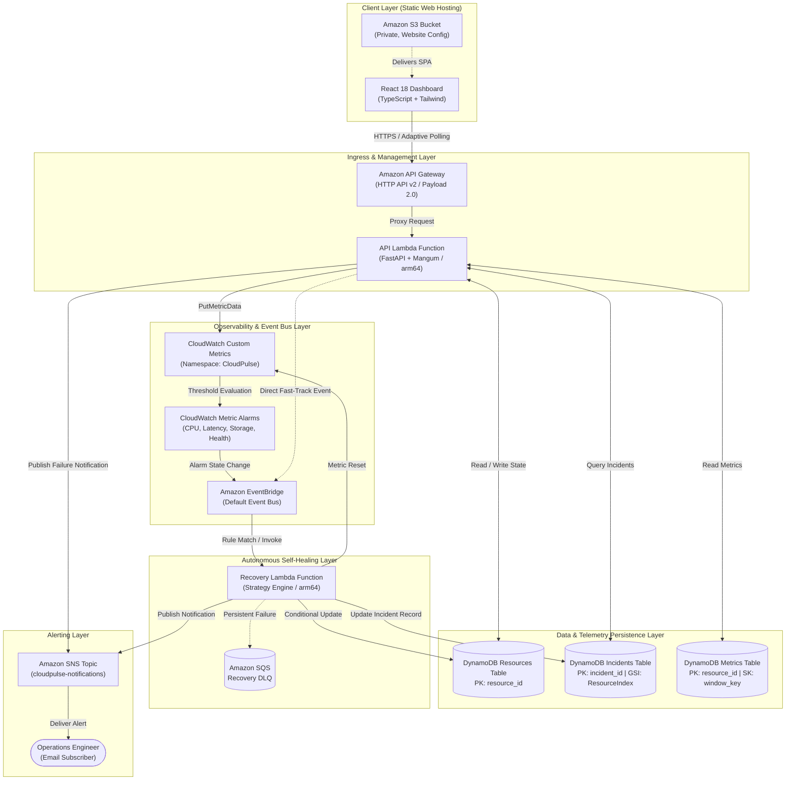

# CloudPulse — System Architecture Reference

**Course:** BCSE355L – Cloud Architecture Design | Fall 2026-2027  
**Document Type:** Core Architectural Reference  
**Version:** 2.0  
**Status:** Implemented, Audited & Verified  

---

## 1. System Overview & Philosophy

CloudPulse is a serverless, event-driven simulation platform demonstrating closed-loop cloud reliability:
- **Autonomous Detection:** Real CloudWatch metric threshold alarms.
- **Decoupled Event Bus:** EventBridge rules routing state-change and direct injection events.
- **Deterministic Self-Healing:** Lambda Recovery Engine with atomic DynamoDB state transitions.
- **Incident Audit Trail:** 14-field incident records with embedded recovery action histories in DynamoDB.
- **Alert Dispatch:** Automated email notifications via Amazon SNS.
- **Live SRE Console:** React SPA polling API Gateway with adaptive frequencies.

> **CRITICAL BOUNDARY:** CloudPulse simulates failures exclusively through DynamoDB state mutations and custom CloudWatch metrics. It **NEVER** terminates, stops, or modifies real AWS EC2, RDS, or VPC infrastructure.

---

## 2. Component Architecture Diagram



---

## 3. Data Flows

### 3.1 Autonomous Failure-to-Recovery Flow (Closed Loop)
1. **Heartbeat / Drift:** Scheduled Simulator Lambda or running service mutates synthetic metric in DynamoDB.
2. **Metric Publishing:** `PutMetricData` sends CPU, memory, storage, and latency data points to CloudWatch.
3. **Alarm Evaluation:** CloudWatch detects that metric exceeds threshold for 2 consecutive 1-minute periods and transitions alarm to `ALARM` state.
4. **Alarm Event Generation:** CloudWatch emits a `CloudWatch Alarm State Change` event to the EventBridge default bus.
5. **Rule Matching:** EventBridge rule `AlarmStateChange` matches the event (filtering out `-SERVICE_HEALTH` composite alarms) and invokes the Recovery Lambda asynchronously.
6. **Idempotency Verification:** Recovery Lambda checks DynamoDB resource state. If state is already `RECOVERY_INITIATED` or `RECOVERY_IN_PROGRESS`, execution terminates safely.
7. **Incident Correlation:** Recovery Lambda retrieves existing open incident or creates a new incident record in DynamoDB.
8. **State Transition:** Resource transitions atomically from `FAILURE_DETECTED` to `RECOVERY_INITIATED` then `RECOVERY_IN_PROGRESS`.
9. **Strategy Execution:** The remediation strategy mapped to the failure type executes, returning nominal metric resets.
10. **Telemetry & State Restoration:** Resource state transitions to `RECOVERED` with nominal metrics; incident status transitions to `RESOLVED`.
11. **Confirmation Metrics:** Nominal metrics are published back to CloudWatch, restoring alarms to `OK`.
12. **Alert Dispatch:** An SNS notification with full incident duration and outcome details is dispatched to subscribers.

### 3.2 Direct Simulation Flow (Fast-Track for Demos & Testing)
1. **Operator Action:** User clicks **Inject Failure** on the React Console or issues `POST /simulate/failure`.
2. **Atomic Failure Recording:** API Lambda validates the resource state, updates DynamoDB state to `FAILURE_DETECTED`, and creates an `OPEN` incident record.
3. **Metric Spike:** API Lambda publishes anomalous metric values to CloudWatch immediately.
4. **Direct Event Emission:** API Lambda publishes a `cloudpulse.simulator: FailureInjected` event to EventBridge with the `incidentId` and `correlationId` in the detail payload.
5. **Instant Execution:** EventBridge rule `DirectSimulatorEvent` routes the event directly to Recovery Lambda without waiting for the 2-minute CloudWatch alarm evaluation window.
6. **Recovery & UI Reflection:** Recovery Lambda resolves the exact incident created in Step 2 and notifies the frontend via the next polling cycle.

---

## 4. Formal Recovery State Machine

The recovery engine operates on an 8-state deterministic state machine:

```
       [ HEALTHY ]
            │
            ▼ (Metric threshold breached)
       [ WARNING ]
            │
            ▼ (Threshold sustained / Anomaly injected)
   [ FAILURE_DETECTED ] ◄──────────┐
            │                      │ Retry (Attempts < 3)
            ▼                      │
  [ RECOVERY_INITIATED ]           │
            │                      │
            ▼                      │
 [ RECOVERY_IN_PROGRESS ]          │
      │            │               │
      │ (Success)  │ (Strategy     │
      │            │  Exception)   │
      ▼            ▼               │
 [ RECOVERED ]   [ RECOVERY_FAILED ]
      │                            │
      │ (Metrics nominal)          ▼ (Attempts >= 3)
      ▼            [ MANUAL_INTERVENTION_REQUIRED ]
  [ HEALTHY ]
```

---

## 5. Remediation Strategy Dispatch Matrix

| Failure Type | Target Resource | Remediation Strategy | Recovery Action | Target Metrics Reset |
|---|---|---|---|---|
| `HIGH_CPU` | `VM-001`, `API-001`, `DB-001` | Scale Out Strategy | `SCALE_OUT` | CPU = 25.0%, Memory = 30.0% |
| `SERVICE_FAILURE` | `API-001`, `VM-001` | Service Restart Strategy | `SERVICE_RESTART` | Latency = 15.0 ms, CPU = 25.0% |
| `STORAGE_EXHAUSTION` | `STORAGE-001` | Storage Cleanup Strategy | `STORAGE_CLEANUP` | Storage = 20.0% |
| `NETWORK_LATENCY` | `DB-001`, `API-001` | Network Reroute Strategy | `NETWORK_REROUTE` | Latency = 15.0 ms |
| `SERVICE_DOWNTIME` | `VM-001`, `API-001` | Failover Standby Strategy | `FAILOVER` | CPU = 25%, Mem = 30%, Stor = 20%, Lat = 15ms |

---

## 6. IAM Least-Privilege Architecture

| Role | Principal | Permitted Actions | Resource Scope |
|---|---|---|---|
| **ApiFunctionRole** | `lambda.amazonaws.com` | `dynamodb:GetItem`, `dynamodb:PutItem`, `dynamodb:UpdateItem`, `dynamodb:Scan` on Resources/Metrics; `dynamodb:Query` on Incidents GSI | Scoped to project tables and GSI ARNs |
| | | `cloudwatch:PutMetricData` | `Resource: "*"` with `Condition: cloudwatch:namespace = "CloudPulse"` |
| | | `events:PutEvents` | Scoped to default EventBus |
| | | `sns:Publish` | Scoped to `cloudpulse-notifications` topic ARN |
| **SimulatorFunctionRole** | `lambda.amazonaws.com` | `dynamodb:GetItem`, `dynamodb:PutItem`, `dynamodb:Scan` | Scoped to ResourcesTable ARN |
| | | `cloudwatch:PutMetricData` | Scoped to `CloudPulse` namespace |
| **RecoveryFunctionRole** | `lambda.amazonaws.com` | `dynamodb:GetItem`, `dynamodb:PutItem`, `dynamodb:UpdateItem`, `dynamodb:Scan`, `dynamodb:Query` | Scoped to ResourcesTable and IncidentsTable ARNs |
| | | `cloudwatch:PutMetricData` | Scoped to `CloudPulse` namespace |
| | | `sns:Publish` | Scoped to `cloudpulse-notifications` topic ARN |
| | | `sqs:SendMessage` | Scoped to `RecoveryDLQ` ARN |
