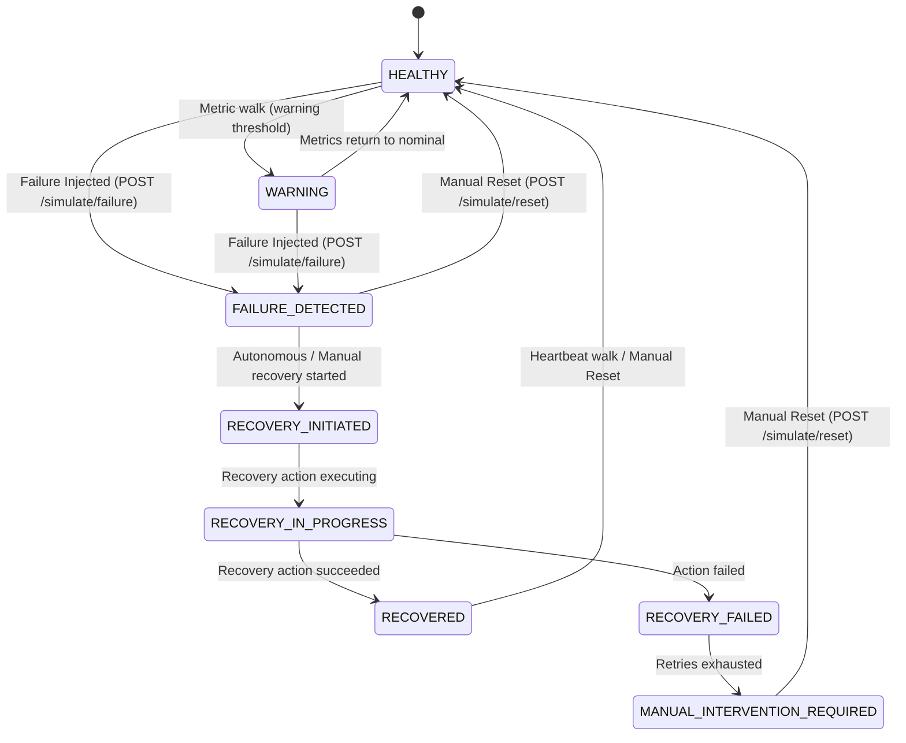

# CloudPulse Failure Simulation Engine Reference

**Version:** 1.0  
**Last Updated:** 2026-09-09  
**Status:** Active  

---

## 1. Overview & Simulation Philosophy

CloudPulse is a serverless, event-driven reliability and self-healing simulator.

> **CRITICAL CONSTRAINT:**  
> CloudPulse simulates failures exclusively through **virtual state and metric mutations** persisted in DynamoDB and emitted to Amazon CloudWatch custom metrics. It **does NOT interact with, stop, modify, or destroy real AWS compute, database, or networking infrastructure** (such as real EC2 instances, RDS databases, or VPC subnets).

### Key Architectural Tenets:
1. **Safety First:** Simulation actions are isolated strictly to DynamoDB virtual resource records (`cloudpulse-resources-{env}`) and custom CloudWatch metrics (namespace `CloudPulse`).
2. **Determinism:** Each failure scenario applies reproducible metric targets, ensuring unit and integration tests are predictable and repeatable.
3. **Observability Integration:** Failure spikes are published to CloudWatch custom metrics with resource dimensions, triggering real CloudWatch metric alarms in deployed AWS environments.
4. **Autonomous Incident Lifecycle:** Injecting a failure automatically creates an `Incident` in DynamoDB (`cloudpulse-incidents-{env}`) in `OPEN` status.

---

## 2. Supported Failure Scenarios

CloudPulse supports five predefined failure scenarios (FS-01 through FS-05):

| Scenario Code | Scenario Name | Primary Metric Spiked | Threshold Breached | Default Severity | Primary Healing Action |
|---|---|---|---|---|---|
| **FS-01** | High CPU Utilization | `cpu_utilization = 92.0%` | > 85.0% failure threshold | `HIGH` | `SCALE_OUT` |
| **FS-02** | Service Failure | `network_latency_ms = 980.0ms` | > 500.0ms failure threshold | `CRITICAL` | `SERVICE_RESTART` |
| **FS-03** | Storage Exhaustion | `storage_utilization = 96.0%` | > 90.0% failure threshold | `MEDIUM` | `STORAGE_CLEANUP` |
| **FS-04** | Network Latency | `network_latency_ms = 750.0ms` | > 500.0ms failure threshold | `MEDIUM` | `NETWORK_REROUTE` |
| **FS-05** | Service Downtime | `cpu = 0.0%`, `latency = 9999.0ms` | Complete unreachability | `CRITICAL` | `FAILOVER` |

---

### Scenario Details

#### FS-01: High CPU Utilization (`HIGH_CPU`)
- **Description:** Simulates an unexpected computational spike (e.g. runaway loop, unindexed query workload, or traffic surge).
- **Target Metrics:**
  - `cpu_utilization`: 92.0%
  - `memory_utilization`: 60.0%
  - `storage_utilization`: 20.0%
  - `network_latency_ms`: 50.0ms
- **Alarms Triggered:** `cloudpulse-{ResourceId}-HIGH_CPU`

#### FS-02: Service Failure (`SERVICE_FAILURE`)
- **Description:** Simulates an internal application process crash or thread deadlock where HTTP requests hang and timeout.
- **Target Metrics:**
  - `cpu_utilization`: 15.0%
  - `memory_utilization`: 20.0%
  - `storage_utilization`: 10.0%
  - `network_latency_ms`: 980.0ms
- **Alarms Triggered:** `cloudpulse-{ResourceId}-SERVICE_FAILURE`

#### FS-03: Storage Exhaustion (`STORAGE_EXHAUSTION`)
- **Description:** Simulates disk capacity saturation (e.g. unbounded log files or temporary cache fill).
- **Target Metrics:**
  - `cpu_utilization`: 30.0%
  - `memory_utilization`: 40.0%
  - `storage_utilization`: 96.0%
  - `network_latency_ms`: 50.0ms
- **Alarms Triggered:** `cloudpulse-{ResourceId}-STORAGE_EXHAUSTION`

#### FS-04: Network Latency (`NETWORK_LATENCY`)
- **Description:** Simulates upstream transit degradation or degraded cross-AZ connectivity.
- **Target Metrics:**
  - `cpu_utilization`: 20.0%
  - `memory_utilization`: 25.0%
  - `storage_utilization`: 15.0%
  - `network_latency_ms`: 750.0ms
- **Alarms Triggered:** `cloudpulse-{ResourceId}-NETWORK_LATENCY`

#### FS-05: Service Downtime (`SERVICE_DOWNTIME`)
- **Description:** Simulates total service unresponsiveness or hard process termination.
- **Target Metrics:**
  - `cpu_utilization`: 0.0%
  - `memory_utilization`: 0.0%
  - `storage_utilization`: 10.0%
  - `network_latency_ms`: 9999.0ms
- **Alarms Triggered:** `cloudpulse-{ResourceId}-SERVICE_DOWNTIME`

---

## 3. Safe Simulation State Machine

The failure engine enforces a strict lifecycle state machine to ensure resources cannot enter conflicting or invalid states:



### Safety Rules:
1. **No Duplicate Injections:** A resource in `FAILURE_DETECTED`, `RECOVERY_INITIATED`, or `RECOVERY_IN_PROGRESS` cannot have another failure injected. The API returns `409 Conflict` (`SIMULATION_ERROR`).
2. **Pre-flight Existence Validation:** The target `resourceId` must exist in DynamoDB. Non-existent resources return `404 Not Found` (`RESOURCE_NOT_FOUND`).
3. **Idempotent Reset:** Manual recovery/reset can be called safely at any time, returning the resource to nominal metrics (`HEALTHY`) and closing open incidents.

---

## 4. Execution Workflow

When `POST /simulate/failure` is invoked, the engine executes six deterministic steps:

```
┌─────────────────────────────────────────────────────────────┐
│ 1. Validate Resource                                        │
│    - Confirm resource exists in DynamoDB                   │
│    - Confirm state is HEALTHY, WARNING, or RECOVERED        │
└──────────────────────────────┬──────────────────────────────┘
                               │
┌──────────────────────────────▼──────────────────────────────┐
│ 2. Update Simulated Health State                            │
│    - current_state = FAILURE_DETECTED                       │
│    - health_status = CRITICAL                               │
│    - active_failure_type = <failureType>                    │
└──────────────────────────────┬──────────────────────────────┘
                               │
┌──────────────────────────────▼──────────────────────────────┐
│ 3. Record Simulated Fault Metrics                           │
│    - Apply deterministic targets (or parameter overrides)   │
│    - Save updated record to DynamoDB resources table        │
└──────────────────────────────┬──────────────────────────────┘
                               │
┌──────────────────────────────▼──────────────────────────────┐
│ 4. Emit CloudWatch Custom Metrics                           │
│    - Namespace: CloudPulse                                  │
│    - Metrics: CPUUtilization, MemoryUtilization,            │
│               StorageUtilization, NetworkLatency            │
│    - Dimensions: ResourceId, ResourceType                   │
└──────────────────────────────┬──────────────────────────────┘
                               │
┌──────────────────────────────▼──────────────────────────────┐
│ 5. Create Incident Record                                   │
│    - Generate UUID v4 incident_id                           │
│    - Set status = OPEN, severity, detected_at               │
│    - Persist to DynamoDB incidents table                    │
└──────────────────────────────┬──────────────────────────────┘
                               │
┌──────────────────────────────▼──────────────────────────────┐
│ 6. Return Structured API Response                           │
│    - HTTP 201 Created                                       │
│    - Resource state, incident details, emitted metrics      │
└─────────────────────────────────────────────────────────────┘
```

---

## 5. API Reference

### 5.1 Inject Failure: `POST /simulate/failure`

Injects a simulated failure scenario onto a target virtual resource.

#### Request Body
```json
{
  "resourceId": "VM-001",
  "failureType": "HIGH_CPU",
  "severity": "HIGH",
  "parameters": {
    "cpu_utilization": 95.0
  }
}
```

- `resourceId` *(string, required)*: Identifier of the resource (e.g. `VM-001`, `API-001`).
- `failureType` *(string, required)*: Either failure enum (`HIGH_CPU`, `SERVICE_FAILURE`, `STORAGE_EXHAUSTION`, `NETWORK_LATENCY`, `SERVICE_DOWNTIME`) or scenario code (`FS-01`, `FS-02`, `FS-03`, `FS-04`, `FS-05`).
- `severity` *(string, optional)*: Override incident severity (`LOW`, `MEDIUM`, `HIGH`, `CRITICAL`). Defaults to scenario default.
- `parameters` *(object, optional)*: Custom metric overrides (e.g. `{"cpu_utilization": 98.0}`).

#### Response (`HTTP 201 Created`)
```json
{
  "message": "Simulated failure 'FS-01 High CPU Utilization' successfully injected on 'VM-001'",
  "scenario_id": "FS-01",
  "scenario_name": "FS-01 High CPU Utilization",
  "resource": {
    "resource_id": "VM-001",
    "resource_type": "VM",
    "current_state": "FAILURE_DETECTED",
    "health_status": "CRITICAL",
    "active_failure_type": "HIGH_CPU",
    "cpu_utilization": 95.0,
    "memory_utilization": 60.0,
    "storage_utilization": 20.0,
    "network_latency_ms": 50.0,
    "updated_at": "2026-09-09T00:15:00Z"
  },
  "incident": {
    "incident_id": "3fa85f64-5717-4562-b3fc-2c963f66afa6",
    "resource_id": "VM-001",
    "failure_type": "HIGH_CPU",
    "severity": "HIGH",
    "status": "OPEN",
    "state_at_detection": "FAILURE_DETECTED",
    "detected_at": "2026-09-09T00:15:00Z",
    "recovery_attempts": 0,
    "recovery_actions": []
  },
  "metrics_emitted": {
    "CPUUtilization": 95.0,
    "MemoryUtilization": 60.0,
    "StorageUtilization": 20.0,
    "NetworkLatency": 50.0
  }
}
```

#### Error Responses
- `404 Not Found`: Resource does not exist (`RESOURCE_NOT_FOUND`).
- `409 Conflict`: Resource is already in failure or active recovery state (`SIMULATION_ERROR`).
- `422 Unprocessable Entity`: Invalid request payload format or unknown failure type.

---

### 5.2 Manual Reset / Recovery: `POST /simulate/reset/{resource_id}`

Resets a simulated resource back to `HEALTHY` with nominal metrics and resolves any active incidents.

#### Request
```http
POST /simulate/reset/VM-001 HTTP/1.1
```

*(Also supports `POST /simulate/reset` and `POST /simulate/recover` with body `{"resourceId": "VM-001"}`)*

#### Response (`HTTP 200 OK`)
```json
{
  "message": "Resource 'VM-001' successfully reset to HEALTHY",
  "resource": {
    "resource_id": "VM-001",
    "resource_type": "VM",
    "current_state": "HEALTHY",
    "health_status": "HEALTHY",
    "active_failure_type": null,
    "cpu_utilization": 25.0,
    "memory_utilization": 30.0,
    "storage_utilization": 20.0,
    "network_latency_ms": 15.0
  },
  "resolved_incidents": [
    "3fa85f64-5717-4562-b3fc-2c963f66afa6"
  ]
}
```

---

## 6. Testing

The failure simulation engine is covered by automated unit tests validating each failure scenario, state transition guard, and API endpoint:

```bash
cd backend
source .venv/bin/activate
pytest tests/unit/test_simulation.py -v
```
