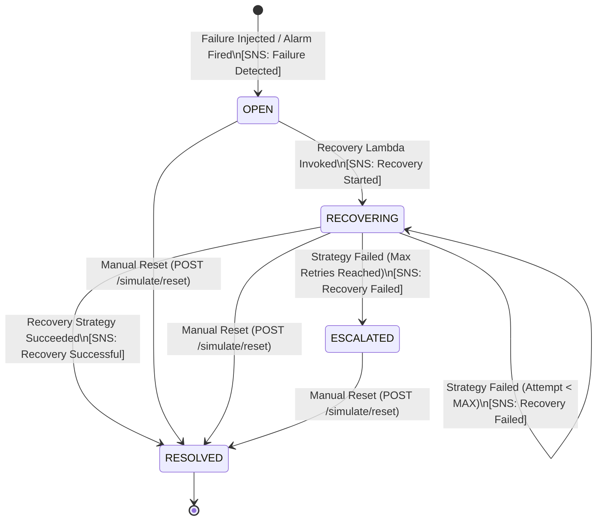
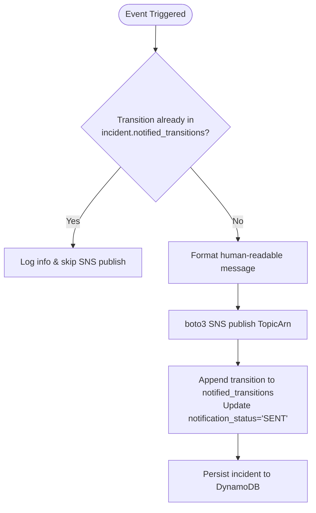

# CloudPulse Incident Lifecycle Architecture

**Version:** 1.0  
**Course:** BCSE355L – Cloud Architecture Design | Fall 2026-2027  
**Status:** Implemented  
**Last Revised:** 2026-09-09  

---

## Table of Contents

1. [Overview](#1-overview)
2. [Lifecycle State Machine](#2-lifecycle-state-machine)
3. [Incident Schema & Field Specification](#3-incident-schema--field-specification)
4. [SNS Email Notifications](#4-sns-email-notifications)
5. [Duplicate Notification Prevention](#5-duplicate-notification-prevention)
6. [Dashboard-Facing APIs](#6-dashboard-facing-apis)
7. [DynamoDB Storage & Audit Trail](#7-dynamodb-storage--audit-trail)
8. [Testing & Verification](#8-testing--verification)

---

## 1. Overview

An **Incident** in CloudPulse represents a detected disruption to a simulated virtual resource (`VM-001`, `API-001`, `DB-001`, `STORAGE-001`). Incidents are created deterministically upon failure detection and transition through an automated self-healing lifecycle managed by EventBridge, the Recovery Lambda, and SNS.

All recovery actions are **simulated**: synthetic resource metrics in DynamoDB are restored to nominal baselines and published to CloudWatch. No real AWS compute or database infrastructure APIs are invoked.

---

## 2. Lifecycle State Machine

### 2.1 State Transition Diagram



### 2.2 Lifecycle Status Definitions

| Status | Description | Trigger | Terminal? |
|---|---|---|---|
| `OPEN` | Failure detected; awaiting automated recovery trigger | Simulation API injection or CloudWatch Alarm event | No |
| `RECOVERING` | Autonomous recovery strategy is currently executing | Recovery Lambda accepts event and dispatches strategy | No |
| `RESOLVED` | Resource successfully restored to nominal health | Recovery strategy succeeds or manual reset executed | Yes |
| `ESCALATED` | Automated recovery failed after `MAX_RECOVERY_ATTEMPTS` (3) | Recovery Lambda retry attempts exhausted | Yes |

---

## 3. Incident Schema & Field Specification

Each incident maintains 14 core lifecycle tracking fields, supported in both standard backend `snake_case` and frontend `camelCase` formats.

### 3.1 Core Tracking Attributes

| # | Field (`snake_case`) | Alias (`camelCase`) | Type | Description |
|---|---|---|---|---|
| 1 | `incident_id` | `incidentId` | `string` (UUID v4) | Unique incident identifier |
| 2 | `resource_id` | `resourceId` | `string` | Identifier of affected resource (`VM-001`, `API-001`, etc.) |
| 3 | `failure_type` | `failureType` | `string` | Scenario enum (`HIGH_CPU`, `SERVICE_FAILURE`, etc.) |
| 4 | `severity` | `severity` | `string` | Priority level (`LOW`, `MEDIUM`, `HIGH`, `CRITICAL`) |
| 5 | `created_at` | `createdAt` | `string` (ISO 8601) | Timestamp when incident item was first created |
| 6 | `detected_at` | `detectedAt` | `string` (ISO 8601) | Timestamp when failure condition was first detected |
| 7 | `recovery_started_at` | `recoveryStartedAt` | `string` (ISO 8601) \| `null` | Timestamp when automated/manual recovery began |
| 8 | `recovered_at` | `recoveredAt` | `string` (ISO 8601) \| `null` | Timestamp when resource reached nominal recovered health |
| 9 | `status` | `status` | `string` | Lifecycle status (`OPEN`, `RECOVERING`, `RESOLVED`, `ESCALATED`) |
| 10 | `recovery_action` | `recoveryAction` | `string` \| `null` | Action applied (`SCALE_OUT`, `SERVICE_RESTART`, `STORAGE_CLEANUP`, `NETWORK_REROUTE`, `FAILOVER`, `MANUAL`) |
| 11 | `recovery_result` | `recoveryResult` | `string` \| `null` | Outcome (`PENDING`, `IN_PROGRESS`, `SUCCESS`, `FAILED`, `MANUALLY_RESOLVED`) |
| 12 | `notification_status` | `notificationStatus` | `string` | Status of SNS email alert dispatch (`NOT_SENT`, `SENT`, `NOT_CONFIGURED`, `FAILED`) |
| 13 | `retry_count` | `retryCount` | `integer` | Number of recovery attempts executed (0 to 3) |
| 14 | `error_message` | `errorMessage` | `string` \| `null` | Exception message or diagnosis detail if recovery failed |

### 3.2 Supplementary Audit Trail Attributes

- **`recovery_actions`** (`list[RecoveryAction]`): Embedded history of every individual action attempted, including:
  * `action_id`: UUID v4
  * `action_type`: `RecoveryActionType` enum
  * `status`: `SUCCEEDED` or `FAILED`
  * `started_at` and `completed_at`
  * `outcome_message`: Summary of outcome
  * `error_detail`: Detailed stack trace or exception text (if failed)
- **`duration_seconds`** (`float` | `null`): Elapsed seconds from `detected_at` to resolution or escalation.
- **`notified_transitions`** (`list[str]`): List of transition strings for which SNS notifications were successfully sent (used for duplicate prevention).
- **`recovery_notes`** (`list[str]`): Free-form log entries appended by operators or recovery routines.

---

## 4. SNS Email Notifications

Human-readable email notifications are dispatched via Amazon SNS at 4 critical lifecycle transition points.

### 4.1 Notification Transition Matrix

| # | Transition | Trigger Event | Subject Format |
|---|---|---|---|
| 1 | `FAILURE_DETECTED` | Incident created via `/simulate/failure` or CloudWatch Alarm | `[CloudPulse] FAILURE DETECTED: {resourceId} — {failureType}` |
| 2 | `RECOVERY_STARTED` | Recovery Lambda accepts event and dispatches strategy | `[CloudPulse] RECOVERY STARTED: {resourceId} — {failureType}` |
| 3 | `RECOVERY_SUCCESSFUL` | Recovery strategy finishes and metrics reset | `[CloudPulse] RECOVERED: {resourceId} — {failureType}` |
| 4 | `RECOVERY_FAILED` | Recovery strategy raises exception | `[CloudPulse] RECOVERY FAILED: {resourceId} — {failureType}` |

### 4.2 Human-Readable Email Message Templates

#### Transition 1: Failure Detected
```text
======================================================================
CLOUDPULSE ALERT: Failure Detected
======================================================================
Incident ID:    a1b2c3d4-e5f6-7890-abcd-ef1234567890
Resource:       VM-001
Failure Type:   HIGH_CPU
Severity:       HIGH
Status:         OPEN
Detected At:    2026-09-09T12:00:00.000000+00:00
======================================================================
Description:
A failure condition has been detected on simulated resource 'VM-001'.
Autonomous self-healing recovery will be initiated via EventBridge.
======================================================================
```

#### Transition 2: Recovery Started
```text
======================================================================
CLOUDPULSE ALERT: Recovery Started
======================================================================
Incident ID:     a1b2c3d4-e5f6-7890-abcd-ef1234567890
Resource:        VM-001
Failure Type:    HIGH_CPU
Status:          RECOVERING
Recovery Action: SCALE_OUT
Progress:        Attempt 1/3
Started At:      2026-09-09T12:00:01.250000+00:00
======================================================================
Description:
Automated recovery workflow has started for resource 'VM-001'.
Executing recovery action: SCALE_OUT.
======================================================================
```

#### Transition 3: Recovery Successful
```text
======================================================================
CLOUDPULSE ALERT: Recovery Successful
======================================================================
Incident ID:       a1b2c3d4-e5f6-7890-abcd-ef1234567890
Resource:          VM-001
Failure Type:      HIGH_CPU
Status:            RESOLVED
Recovery Action:   SCALE_OUT
Recovery Duration: 5.20 seconds
Resolved At:       2026-09-09T12:00:06.450000+00:00
======================================================================
Description:
Resource 'VM-001' has been successfully recovered.
Synthetic metrics have returned to nominal operating thresholds.
======================================================================
```

#### Transition 4: Recovery Failed
```text
======================================================================
CLOUDPULSE ALERT: Recovery Failed
======================================================================
Incident ID:    a1b2c3d4-e5f6-7890-abcd-ef1234567890
Resource:       VM-001
Failure Type:   HIGH_CPU
Status:         RECOVERING
Progress:       Attempt 1/3
Error Message:  Simulated scale-out capacity error: capacity unavailable
======================================================================
Description:
Automated recovery attempt failed for resource 'VM-001'.
Manual intervention may be required if retry attempts are exhausted.
======================================================================
```

---

## 5. Duplicate Notification Prevention

To avoid email storms and duplicate notifications during retries or duplicate EventBridge invocations, CloudPulse applies a two-layer guard:



1. **State Machine Pre-Read Guard**: The Recovery Lambda checks the resource's current state before processing. Duplicate events arriving when the resource is already in `RECOVERY_INITIATED` or `RECOVERY_IN_PROGRESS` are terminated immediately.
2. **Incident-Level Transition De-duplication**:
   - `incident.notified_transitions` maintains an immutable set of sent transition names (`FAILURE_DETECTED`, `RECOVERY_STARTED`, `RECOVERY_SUCCESSFUL`, `RECOVERY_FAILED`).
   - `NotificationService.notify()` inspects this list before calling `sns.publish()`. If present, the notification is skipped.
3. **Non-Fatal SNS Isolation**: SNS ClientErrors or empty topic ARNs log warnings without throwing exceptions, ensuring that network hiccups on notifications never interrupt recovery workflows.

---

## 6. Dashboard-Facing APIs

The FastAPI backend exposes dedicated incident management endpoints consumed by the CloudPulse dashboard.

### 6.1 `GET /incidents`

List incidents with optional query filters, newest first.

**Query Parameters:**
- `resource_id` (`string`, optional): Filter by resource, e.g. `VM-001`.
- `status` (`string`, optional): Filter by lifecycle status (`OPEN`, `RECOVERING`, `RESOLVED`, `ESCALATED`).
- `failure_type` (`string`, optional): Filter by failure scenario.
- `limit` (`integer`, default: 50, max: 200): Pagination limit.

**Response Body (`200 OK`):**
```json
[
  {
    "incident_id": "a1b2c3d4-e5f6-7890-abcd-ef1234567890",
    "incidentId": "a1b2c3d4-e5f6-7890-abcd-ef1234567890",
    "resource_id": "VM-001",
    "resourceId": "VM-001",
    "failure_type": "HIGH_CPU",
    "failureType": "HIGH_CPU",
    "severity": "HIGH",
    "status": "RESOLVED",
    "created_at": "2026-09-09T12:00:00Z",
    "createdAt": "2026-09-09T12:00:00Z",
    "detected_at": "2026-09-09T12:00:00Z",
    "detectedAt": "2026-09-09T12:00:00Z",
    "recovery_started_at": "2026-09-09T12:00:01Z",
    "recoveryStartedAt": "2026-09-09T12:00:01Z",
    "recovered_at": "2026-09-09T12:00:06Z",
    "recoveredAt": "2026-09-09T12:00:06Z",
    "resolved_at": "2026-09-09T12:00:06Z",
    "escalated_at": null,
    "duration_seconds": 6.2,
    "recovery_action": "SCALE_OUT",
    "recoveryAction": "SCALE_OUT",
    "recovery_result": "SUCCESS",
    "recoveryResult": "SUCCESS",
    "notification_status": "SENT",
    "notificationStatus": "SENT",
    "retry_count": 1,
    "retryCount": 1,
    "recovery_attempts": 1,
    "error_message": null,
    "errorMessage": null
  }
]
```

### 6.2 `GET /incidents/{incident_id}`

Retrieve full incident detail including embedded recovery actions history.

**Response Body (`200 OK`):**
Includes all fields above plus:
- `state_at_detection`: `"FAILURE_DETECTED"`
- `state_at_resolution`: `"RECOVERED"`
- `recovery_actions`: Array of embedded `RecoveryAction` objects
- `recovery_notes`: Array of operator/recovery log strings
- `notified_transitions`: `["FAILURE_DETECTED", "RECOVERY_STARTED", "RECOVERY_SUCCESSFUL"]`

---

## 7. DynamoDB Storage & Audit Trail

Incidents are stored in the single table `cloudpulse-incidents-{env}`:

- **Partition Key (PK):** `incident_id` (`String`, UUID v4)
- **Global Secondary Indexes (GSIs):**
  1. `ByResourceDetectedAt`: PK `resource_id`, SK `detected_at` (query incidents by resource)
  2. `ByStatusDetectedAt`: PK `status`, SK `detected_at` (query active vs resolved incidents)
  3. `ByFailureTypeDetectedAt`: PK `failure_type`, SK `detected_at` (query incidents by scenario)

Embedded recovery actions avoid cross-table joins, fitting comfortably within DynamoDB's 400 KB item size limit.

---

## 8. Testing & Verification

Unit test coverage verifies:
1. All 14 fields track and serialize in both snake_case and camelCase.
2. Notifications for all 4 transitions (`FAILURE_DETECTED`, `RECOVERY_STARTED`, `RECOVERY_SUCCESSFUL`, `RECOVERY_FAILED`).
3. De-duplication logic prevents duplicate SNS alerts.
4. Human-readable subject and message layout contain incident ID, resource, status, failure type, and duration.
5. Integration with `/incidents` and `/incidents/{id}` endpoints.

### Running Test Suite:
```bash
cd backend
source .venv/bin/activate
pytest tests/unit/test_incident_lifecycle.py -v
```

**Status:** 12 passed, 0 failed. Full test suite: 269 passed, 0 failed.
