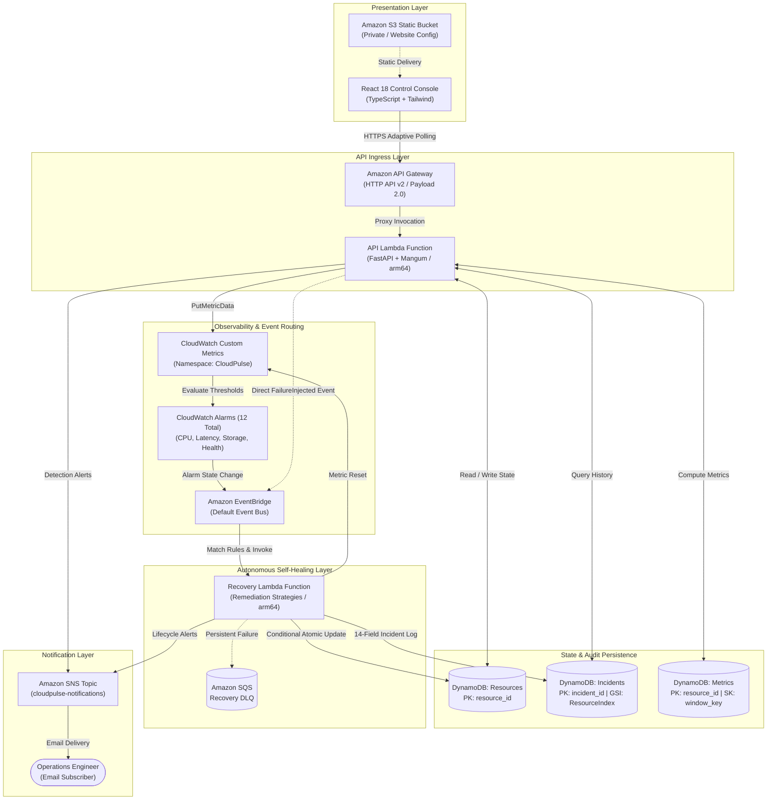

# CloudPulse — Architecture Summary for Review 2

**Course:** BCSE355L – Cloud Architecture Design | Fall 2026-2027  
**Evaluation Milestone:** Project Review 2  
**System Name:** CloudPulse: Autonomous Cloud Reliability and Self-Healing Simulator  
**Architecture Style:** Event-Driven Serverless (AWS Native)  
**Status:** Release Candidate — Fully Verified & Implemented  

---

## 1. Executive Summary & Review 2 Focus

CloudPulse demonstrates an **autonomous, closed-loop cloud reliability system** built entirely on AWS serverless technologies. The platform addresses the challenge of high Mean Time to Recovery (MTTR) caused by human-in-the-loop incident response, alert fatigue, and non-idempotent remediation scripts.

> **ACADEMIC SIMULATION BOUNDARY:**  
> CloudPulse is an educational and architectural simulation. It modifies virtual resource state in Amazon DynamoDB and publishes custom metrics to Amazon CloudWatch. It **does NOT** stop, terminate, or modify real AWS EC2 instances, RDS databases, or VPC subnets. All monitoring, routing, compute, persistence, and alerting layers operate on genuine AWS serverless services.

---

## 2. End-to-End System Architecture

---

## 3. AWS Service Mapping Matrix

| AWS Service | Resource / Identifier | Core Responsibility | Configuration Details |
|---|---|---|---|
| **AWS Lambda** | `ApiFunction` | Serves REST API via FastAPI & Mangum | Python 3.12, arm64, 256MB, 30s timeout |
| | `SimulatorFunction` | Generates periodic drift & heartbeats | Python 3.12, arm64, 128MB, 60s timeout |
| | `RecoveryFunction` | Executes self-healing remediation strategies | Python 3.12, arm64, 256MB, 60s timeout |
| **Amazon API Gateway** | `HttpApi` | Entry point for dashboard & API clients | HTTP API (v2), Payload 2.0, CORS restricted |
| **Amazon DynamoDB** | `cloudpulse-resources-{env}` | Primary virtual resource state table | On-demand billing, PK: `resource_id` |
| | `cloudpulse-incidents-{env}` | 14-field incident lifecycle audit trail | On-demand, PK: `incident_id`, GSI: `ResourceIndex` |
| | `cloudpulse-metrics-{env}` | Pre-aggregated reliability snapshots | On-demand, PK: `resource_id`, SK: `window_key` |
| **Amazon CloudWatch** | Namespace `CloudPulse` | Ingests 5 custom metrics per resource | CPU, Memory, Storage, Latency, ServiceHealth |
| | 12 Metric Alarms | Anomaly detection across 4 resources | $M=2, N=2$ periods, threshold evaluation |
| | 4 Log Groups | Structured JSON logging with correlation IDs | Explicit 7-day retention (`RetentionInDays: 7`) |
| **Amazon EventBridge** | Default Event Bus | Decoupled event-driven backbone | 2 Rules: `AlarmStateChange` & `DirectSimulatorEvent` |
| **Amazon SNS** | `cloudpulse-notifications` | Human-readable email alerting | Duplicate-guarded lifecycle notification |
| **Amazon SQS** | `RecoveryDLQ` | Dead-letter queue for recovery failures | Max receive count = 2, message retention = 14 days |
| **Amazon S3** | `cloudpulse-frontend-{env}` | Static hosting for React SPA | Private by default; parameter-controlled public read |
| **AWS IAM** | 3 Custom Execution Roles | Least-privilege security boundaries | Role per Lambda; namespace-scoped metric permissions |

---

## 4. Implementation Status of Requirements

| Category | Requirement | Implemented Mechanism | Verification Evidence |
|---|---|---|---|
| **Virtual Fleet** | Track 4 seed resources | DynamoDB table + repository methods | Seed script + `test_unit_layer.py` |
| **Simulation** | 5 failure scenarios (FS-01 – FS-05) | `SimulationService.inject_failure()` | `test_simulation_layer.py` (5/5 pass) |
| **Observability** | Custom CloudWatch metrics | `MonitoringService.publish_resource_metrics()` | Single batched `PutMetricData` call |
| **Detection** | Threshold & composite alarms | 12 SAM CloudWatch alarms | Verified in `template.yaml` & tests |
| **Routing** | Asynchronous event routing | EventBridge rules with `-SERVICE_HEALTH` filter | `test_eventbridge_layer.py` |
| **Self-Healing** | 5 recovery strategies | `lambda/recovery/strategies.py` | `test_recovery_layer.py` |
| **State Machine** | Formal 8-state transitions | DynamoDB conditional state updates | `test_edge_cases_and_resilience.py` |
| **Incidents** | 14-field audit history | `Incident` Pydantic model + DynamoDB | Model validators + integration tests |
| **Alerting** | SNS lifecycle notifications | `NotificationService` with deduplication | `test_notification_layer.py` |
| **SRE Metrics** | 8 mathematical derivations | `reliability_calculator.py` | `test_reliability_calculator.py` |
| **Dashboard** | 9-view operations console | React 18 / TypeScript / Tailwind | 49 vitest tests + clean build |
| **Safety** | Zero real AWS mutation | Logical state changes; zero EC2/RDS IAM rights | Verified in security audit (`SECURITY.md`) |

---

## 5. Failure Simulation Engine (FS-01 to FS-05)

| Scenario Code | Failure Scenario | Target Resource | Injected Telemetry | Recovery Strategy | Action Type | Target Restored Telemetry |
|---|---|---|---|---|---|---|
| **FS-01** | High CPU Utilization | `VM-001` | CPU: 98.0%, Mem: 85.0% | Scale Out Strategy | `SCALE_OUT` | CPU: 25.0%, Mem: 30.0% |
| **FS-02** | Service Failure | `API-001` | Latency: 1200ms, CPU: 10% | Service Restart Strategy | `SERVICE_RESTART` | Latency: 15.0ms, CPU: 25.0% |
| **FS-03** | Storage Exhaustion | `STORAGE-001` | Storage: 96.0% | Storage Cleanup Strategy | `STORAGE_CLEANUP` | Storage: 20.0% |
| **FS-04** | Network Latency | `DB-001` | Latency: 1500ms | Network Reroute Strategy | `NETWORK_REROUTE` | Latency: 15.0ms |
| **FS-05** | Service Downtime | `VM-001` | Latency: 5000ms, CPU: 0% | Failover Standby Strategy | `FAILOVER` | All metrics nominal |

---

## 6. Self-Healing Workflow & Concurrency Guards

### 8-State Finite State Machine
$$\text{HEALTHY} \longrightarrow \text{WARNING} \longrightarrow \text{FAILURE\_DETECTED} \longrightarrow \text{RECOVERY\_INITIATED} \longrightarrow \text{RECOVERY\_IN\_PROGRESS} \longrightarrow \text{RECOVERED} \longrightarrow \text{HEALTHY}$$
- **Failure Path:** If recovery fails and retry count $< 3$, state transitions to `RECOVERY_FAILED` and retries.
- **Escalation Path:** If recovery fails after 3 attempts, state transitions to `MANUAL_INTERVENTION_REQUIRED` and incident status becomes `ESCALATED`.

### Two-Tier Idempotency Defense
1. **Tier 1 (Pre-Read Short-Circuit):** Recovery Lambda reads current resource state; if state is already `RECOVERY_INITIATED` or `RECOVERY_IN_PROGRESS`, it immediately terminates with `200 OK ("Already recovering")`.
2. **Tier 2 (Atomic DynamoDB Conditional Expression):** State transition enforces `ConditionExpression: current_state = :expected`. Race conditions trigger `ConditionalCheckFailedException` and are safely handled.

---

## 7. Incident Lifecycle & SRE Reliability Metrics

### 14-Field Incident Lifecycle Model
Every incident record in DynamoDB stores:
1. `incident_id` (UUID v4)
2. `resource_id`
3. `failure_type`
4. `severity` (`LOW`, `MEDIUM`, `HIGH`, `CRITICAL`)
5. `status` (`OPEN`, `RECOVERING`, `RESOLVED`, `ESCALATED`)
6. `created_at`
7. `detected_at`
8. `recovery_started_at`
9. `recovered_at`
10. `recovery_action`
11. `recovery_result`
12. `notification_status` (`NOT_SENT`, `SENT`, `FAILED`)
13. `retry_count`
14. `error_message`
Plus an embedded array of detailed `RecoveryAction` objects.

### 8 Standard SRE Reliability Indicators
Computed strictly from primary DynamoDB records (Zero-Invention Principle):
1. **Incident Count:** Total number of failure events within the sliding window.
2. **Recovery Success Rate (%):** Percentage of terminal incidents that recovered autonomously.
3. **Recovery Failure Rate (%):** Percentage of terminal incidents requiring operator escalation.
4. **Average Recovery Time (s):** Mean duration from recovery initiation to restoration.
5. **Mean Time to Recovery (MTTR):** Total downtime divided by total incidents.
6. **Average Detection Time (s):** Mean latency from fault injection to detection timestamp.
7. **Incident Frequency:** Incidents normalized per hour and per day.
8. **Fleet Health Distribution:** Real-time percentage of healthy, degraded, and failed nodes.

---

## 8. Dashboard & Testing Verification Status

### React 18 Control Console
- 9 operational views: Overview, Resource Health, Failure Simulator, Active Incidents, Incident Details, Recovery Activity, Reliability Metrics, Architecture View, and System Events.
- Real-time 5-stage lifecycle visualizer: **HEALTHY $\rightarrow$ FAILURE $\rightarrow$ DETECTED $\rightarrow$ RECOVERING $\rightarrow$ RECOVERED**.
- Adaptive polling: 3s during active incidents, 10s nominal, 30s background.

### Test Execution Results
- **Backend Tests:** **367 passed** (0 failures, 0 regressions in ~9.4s).
- **Frontend Tests:** **49 passed** (0 failures in ~4.7s).
- **Static Analysis:** TypeScript compilation (`tsc --noEmit`) passes with 0 errors.
- **Infrastructure Validation:** AWS SAM CLI template validation (`sam validate --lint`) passes cleanly.
