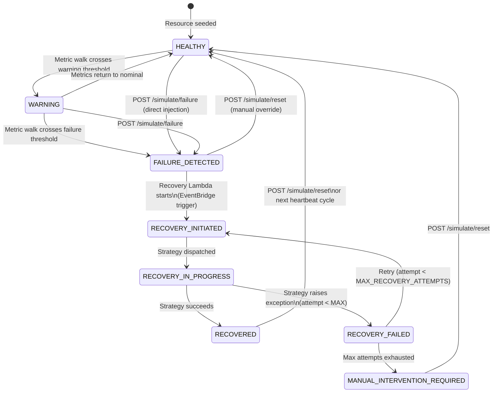

# CloudPulse Self-Healing Architecture

**Version:** 1.0  
**Course:** BCSE355L – Cloud Architecture Design | Fall 2026-2027  
**Status:** Implemented  
**Last Revised:** 2026-09-09

---

## Table of Contents

1. [Overview](#1-overview)
2. [State Machine](#2-state-machine)
3. [Recovery Strategies](#3-recovery-strategies)
4. [Execution Flow](#4-execution-flow)
5. [Idempotency and Duplicate Event Protection](#5-idempotency-and-duplicate-event-protection)
6. [Retry Behavior](#6-retry-behavior)
7. [Audit Trail](#7-audit-trail)
8. [SNS Notifications](#8-sns-notifications)
9. [Safety Guarantee](#9-safety-guarantee)
10. [Testing](#10-testing)

---

## 1. Overview

CloudPulse implements **autonomous self-healing** for simulated cloud resources. When a CloudWatch alarm fires (or a failure is directly injected via the API), the system:

1. Detects the failure type from the EventBridge event
2. Transitions the resource through a lifecycle state machine
3. Executes the appropriate simulated recovery strategy
4. Updates the incident record with a full audit trail
5. Resets resource metrics to nominal values
6. Sends SNS notifications on success or failure

> **Safety guarantee:** All recovery actions are **simulated**. The system mutates virtual resource state in DynamoDB and publishes synthetic metric resets to CloudWatch. It does **not** call `ec2:RebootInstances`, `rds:RebootDBInstance`, `lambda:DeleteFunction`, or any other real AWS infrastructure API.

---

## 2. State Machine

### 2.1 Mermaid Diagram



### 2.2 State Definitions

| State | Description | Who Sets It |
|-------|-------------|-------------|
| `HEALTHY` | All metrics within nominal range | Simulator heartbeat or manual reset |
| `WARNING` | One or more metrics in warning band | Simulator heartbeat |
| `FAILURE_DETECTED` | Metric spike detected; alarm firing | Simulation API injection |
| `RECOVERY_INITIATED` | Recovery Lambda accepted the event | Recovery Lambda (pre-read gate) |
| `RECOVERY_IN_PROGRESS` | Recovery strategy is executing | Recovery Lambda |
| `RECOVERED` | Strategy succeeded; metrics reset | Recovery Lambda |
| `RECOVERY_FAILED` | Strategy raised an exception | Recovery Lambda |
| `MANUAL_INTERVENTION_REQUIRED` | Max retry attempts exhausted | Recovery Lambda |

### 2.3 Transition Guards

| From | To | Condition |
|------|----|-----------|
| Any | `RECOVERY_INITIATED` | Resource must be in `FAILURE_DETECTED` (conditional DynamoDB update with `ConditionExpression`) |
| Any | `RECOVERY_IN_PROGRESS` | Resource must be in `RECOVERY_INITIATED` |
| `RECOVERY_FAILED` | `RECOVERY_INITIATED` | `recovery_attempts < MAX_RECOVERY_ATTEMPTS` |
| `RECOVERY_FAILED` | `MANUAL_INTERVENTION_REQUIRED` | `recovery_attempts >= MAX_RECOVERY_ATTEMPTS` |

---

## 3. Recovery Strategies

Each failure type maps to a dedicated simulated recovery strategy.

### 3.1 Strategy Table

| Failure Type | Recovery Action | Primary Metric Reset | Description |
|--------------|-----------------|---------------------|-------------|
| `HIGH_CPU` | `SCALE_OUT` | `cpu_utilization = 25%` | Simulated horizontal scale-out: increases virtual CPU capacity so per-instance load drops to nominal |
| `SERVICE_FAILURE` | `SERVICE_RESTART` | `network_latency_ms = 15ms`, `cpu_utilization = 25%` | Simulated process restart: brings the crashed service back online, health checks resume |
| `STORAGE_EXHAUSTION` | `STORAGE_CLEANUP` | `storage_utilization = 20%` | Simulated cleanup: removes temp files, compacts logs, frees 76% of consumed storage |
| `NETWORK_LATENCY` | `NETWORK_REROUTE` | `network_latency_ms = 15ms` | Simulated traffic reroute: activates a low-latency alternate path, BGP convergence simulated |
| `SERVICE_DOWNTIME` | `FAILOVER` | All metrics to nominal | Simulated failover: promotes standby instance, re-establishes all connections |

### 3.2 Nominal Post-Recovery Values

After a successful recovery, the relevant metrics are reset to these values:

| Metric | Nominal Value |
|--------|---------------|
| `cpu_utilization` | `25.0%` |
| `memory_utilization` | `30.0%` |
| `storage_utilization` | `20.0%` |
| `network_latency_ms` | `15.0ms` |

These values match `SimulationService._NOMINAL_METRICS` to ensure consistency between auto-recovery and manual reset paths.

### 3.3 Strategy Dispatcher

```python
# lambda/recovery/strategies.py
dispatch_strategy(FailureType.HIGH_CPU)       # → ScaleOutStrategy (SCALE_OUT)
dispatch_strategy(FailureType.SERVICE_FAILURE) # → ServiceRestartStrategy (SERVICE_RESTART)
dispatch_strategy(FailureType.STORAGE_EXHAUSTION) # → StorageCleanupStrategy
dispatch_strategy(FailureType.NETWORK_LATENCY) # → NetworkRerouteStrategy
dispatch_strategy(FailureType.SERVICE_DOWNTIME) # → FailoverStrategy
```

An unknown `FailureType` raises `ValueError`.

---

## 4. Execution Flow

### 4.1 Happy Path (Successful Recovery)

```
EventBridge Event (CloudWatch Alarm or Direct Injection)
          │
          ▼
Recovery Lambda: _parse_event()
  - Extract resource_id and failure_type
          │
          ▼
resource_repo.get(resource_id)
  - IF current_state != FAILURE_DETECTED → return 200 "Already recovering"  [idempotency gate]
  - IF current_state == FAILURE_DETECTED → continue
          │
          ▼
resource_repo.update_state(RECOVERY_INITIATED, condition=FAILURE_DETECTED)
  [DynamoDB ConditionExpression: current_state = FAILURE_DETECTED]
          │
          ▼
incident_repo.list(resource_id=resource_id)
  - IF open/recovering incident found → use it
  - IF not found → create new Incident(status=RECOVERING, recovery_attempts=0)
          │
          ▼
resource_repo.update_state(RECOVERY_IN_PROGRESS)
          │
          ▼
dispatch_strategy(failure_type).execute(resource_id)
  → Returns (outcome_message, metrics_delta)
          │
          ▼
Apply metrics_delta to resource:
  resource.model_copy(update={...metrics_delta, state=RECOVERED, health=HEALTHY})
  resource_repo.put(updated_resource)
  MonitoringService().publish_resource_metrics(updated_resource)  [CloudWatch metric reset]
          │
          ▼
Update Incident:
  - Add RecoveryAction(status=SUCCEEDED)
  - recovery_attempts += 1
  - status = RESOLVED
  - resolved_at = now
  - duration_seconds = computed
incident_repo.update(updated_incident)
          │
          ▼
SNS: "[CloudPulse] RECOVERED: {resource_id} — {failure_type}"
          │
          ▼
Return 200 {incident_id, final_state="RECOVERED", recovery_action_type, duration_seconds}
```

### 4.2 Failure Path

```
dispatch_strategy(failure_type).execute(resource_id)
  → Raises RecoveryStrategyError
          │
          ▼
Create RecoveryAction(status=FAILED, error_detail=str(exc))
          │
          ▼
new_attempts = len(incident.recovery_actions) + 1

IF new_attempts < MAX_RECOVERY_ATTEMPTS (3):
  resource_repo.update_state(RECOVERY_FAILED)
  incident: status=RECOVERING (retry possible)
  → Return 500 "Recovery failed, retry available"

IF new_attempts >= MAX_RECOVERY_ATTEMPTS (3):
  resource_repo.update_state(MANUAL_INTERVENTION_REQUIRED)
  incident: status=ESCALATED, escalated_at=now
  → Return 500 "Recovery failed, manual intervention required"
          │
          ▼
SNS: "[CloudPulse] RECOVERY FAILED: {resource_id} — {failure_type}"
```

---

## 5. Idempotency and Duplicate Event Protection

### 5.1 Two-Layer Guard

EventBridge guarantees **at-least-once** delivery. The recovery Lambda handles duplicates with a two-layer guard:

**Layer 1 — Pre-read gate (fast path):**
```python
pre_update_resource = resource_repo.get(resource_id)
if pre_update_resource.current_state != ResourceState.FAILURE_DETECTED:
    return {"statusCode": 200, "body": "Already recovering"}
```

If the resource is already past `FAILURE_DETECTED` (e.g., in `RECOVERY_INITIATED`), the handler exits immediately without any write operations.

**Layer 2 — Conditional DynamoDB update (race guard):**
```python
updated_resource = resource_repo.update_state(
    resource_id=resource_id,
    new_state=ResourceState.RECOVERY_INITIATED,
    condition_state=ResourceState.FAILURE_DETECTED,  # ConditionExpression
)
```

Even if two Lambda invocations pass the pre-read gate simultaneously, only one can succeed the conditional DynamoDB update. The second one's condition will fail (`ConditionalCheckFailedException`), which the repository catches and converts to a read of the current state.

### 5.2 Why Both Layers Are Needed

| Scenario | Layer 1 | Layer 2 |
|----------|---------|---------|
| Sequential duplicates (second arrives after first completes) | ✅ Catches it | Not reached |
| Concurrent duplicates (arrive at the same time) | ❌ Both pass | ✅ One wins |

### 5.3 Alarm Flapping

CloudWatch `EvaluationPeriods: 2` prevents single-spike false alarms. If metrics are still elevated at the next evaluation, the alarm remains `ALARM` but does not re-fire to EventBridge (state is already `ALARM`). No duplicate Lambda invocation occurs.

---

## 6. Retry Behavior

| Parameter | Value |
|-----------|-------|
| `MAX_RECOVERY_ATTEMPTS` | `3` |
| Retry trigger | Manual re-injection via `POST /simulate/failure` or a new EventBridge alarm trigger |
| Retry tracking | `Incident.recovery_attempts` and `Incident.recovery_actions` list |
| Exhaustion action | Resource → `MANUAL_INTERVENTION_REQUIRED`, Incident → `ESCALATED` |

### 6.1 Retry Sequence

```
Attempt 1 (recovery_attempts=1): RECOVERY_IN_PROGRESS → RECOVERY_FAILED
Attempt 2 (recovery_attempts=2): RECOVERY_IN_PROGRESS → RECOVERY_FAILED
Attempt 3 (recovery_attempts=3): RECOVERY_IN_PROGRESS → MANUAL_INTERVENTION_REQUIRED
                                   Incident: ESCALATED
```

At exhaustion, the resource requires manual reset via `POST /simulate/reset/{resource_id}`.

### 6.2 Recovery Duration Measurement

Each `RecoveryAction` records:
- `started_at`: when `execute()` was called
- `completed_at`: when `execute()` returned or raised

The `Incident.duration_seconds` field records total elapsed time from `detected_at` to `resolved_at`/`escalated_at`.

---

## 7. Audit Trail

Every recovery operation leaves a complete audit record in DynamoDB:

### 7.1 Incident Record (per failure event)

```json
{
  "incident_id": "3fa85f64-5717-4562-b3fc-2c963f66afa6",
  "resource_id": "VM-001",
  "failure_type": "HIGH_CPU",
  "severity": "HIGH",
  "status": "RESOLVED",
  "state_at_detection": "FAILURE_DETECTED",
  "state_at_resolution": "RECOVERED",
  "detected_at": "2026-09-09T06:00:00Z",
  "recovery_initiated_at": "2026-09-09T06:00:05Z",
  "resolved_at": "2026-09-09T06:00:10Z",
  "duration_seconds": 10.2,
  "recovery_attempts": 1,
  "notification_sent": true,
  "recovery_actions": [
    {
      "action_id": "b2c3d4e5-f6a7-4890-bcde-f12345678901",
      "action_type": "SCALE_OUT",
      "status": "SUCCEEDED",
      "outcome_message": "Simulated scale-out: reset CPU to 25%, memory to 30%",
      "started_at": "2026-09-09T06:00:05Z",
      "completed_at": "2026-09-09T06:00:10Z"
    }
  ]
}
```

### 7.2 Audit Fields Explained

| Field | Purpose |
|-------|---------|
| `recovery_attempts` | Always equals `len(recovery_actions)` (model invariant) |
| `recovery_actions` | Ordered list — one entry per attempt |
| `duration_seconds` | Total MTTR from detection to resolution |
| `notification_sent` | Confirms SNS was triggered |
| `state_at_detection` | Snapshot of resource state when incident opened |
| `state_at_resolution` | Snapshot of resource state when incident closed |

---

## 8. SNS Notifications

| Event | SNS Subject | Sent When |
|-------|-------------|-----------|
| Recovery success | `[CloudPulse] RECOVERED: {resource_id} — {failure_type}` | `incident.status = RESOLVED` |
| Recovery failure | `[CloudPulse] RECOVERY FAILED: {resource_id} — {failure_type}` | `incident.status = ESCALATED` or attempt failed |
| Attempt failure (non-final) | `[CloudPulse] RECOVERY ATTEMPT FAILED: {resource_id}` | Each failed attempt before exhaustion |

SNS failures are **non-fatal** — a `ClientError` during `sns.publish()` is caught, logged as a warning, and does not fail the Lambda.

---

## 9. Safety Guarantee

CloudPulse recovery operates **exclusively** on virtual state. The following table documents every write operation and confirms none touch real infrastructure:

| Operation | Target | Safe? |
|-----------|--------|-------|
| `resource_repo.update_state()` | `cloudpulse-resources-{env}` DynamoDB table | ✅ Virtual state only |
| `resource_repo.put()` | `cloudpulse-resources-{env}` DynamoDB table | ✅ Virtual metrics |
| `incident_repo.create()` | `cloudpulse-incidents-{env}` DynamoDB table | ✅ Audit records |
| `incident_repo.update()` | `cloudpulse-incidents-{env}` DynamoDB table | ✅ Audit records |
| `MonitoringService.publish_resource_metrics()` | CloudWatch namespace `CloudPulse` | ✅ Custom metrics, not production metrics |
| `sns.publish()` | SNS topic `cloudpulse-notifications-{env}` | ✅ Demo notifications |

**No calls to:** `ec2:*`, `rds:*`, `ecs:*`, `lambda:DeleteFunction`, `autoscaling:*`, or any other compute/database API.

---

## 10. Testing

### 10.1 Test Files

| File | What It Tests |
|------|---------------|
| `tests/unit/test_recovery_strategies.py` | Strategy dispatch, metric delta correctness, all 5 failure types |
| `tests/unit/test_recovery_integration.py` | End-to-end handler flow with mocked repos, duplicate events, failure path, escalation |
| `tests/unit/test_recovery_handler.py` | Event parsing, alarm name parser, SNS resilience, idempotency guard |

### 10.2 Running Tests

```bash
cd backend
source .venv/bin/activate

# Strategy unit tests (fast, no I/O)
pytest tests/unit/test_recovery_strategies.py -v

# Integration tests (mocked I/O)
pytest tests/unit/test_recovery_integration.py -v

# All recovery-related tests
pytest tests/unit/test_recovery_strategies.py \
       tests/unit/test_recovery_integration.py \
       tests/unit/test_recovery_handler.py -v

# Full unit suite
pytest tests/unit/ -q --tb=short
```

### 10.3 Coverage Matrix

| Scenario | Test | Status |
|----------|------|--------|
| HIGH_CPU successful recovery | `test_successful_recovery_high_cpu` | ✅ |
| SERVICE_FAILURE successful recovery | `test_successful_recovery_service_failure` | ✅ |
| STORAGE_EXHAUSTION successful recovery | `test_successful_recovery_storage_exhaustion` | ✅ |
| NETWORK_LATENCY successful recovery | `test_successful_recovery_network_latency` | ✅ |
| SERVICE_DOWNTIME successful recovery | `test_successful_recovery_service_downtime` | ✅ |
| Duplicate event idempotency | `test_duplicate_event_is_idempotent` | ✅ |
| Failed recovery → RECOVERY_FAILED | `test_failed_recovery_transitions_to_recovery_failed` | ✅ |
| Invalid event → 400 | `test_invalid_event_returns_400` | ✅ |
| Unknown failure type → 400 | `test_unknown_failure_type_in_alarm_name` | ✅ |
| Metrics reset after recovery | `test_resource_metrics_reset_after_recovery` | ✅ |
| Existing incident reused | `test_existing_incident_is_reused` | ✅ |
| SNS success notification | `test_sns_success_notification` | ✅ |
| SNS failure notification | `test_sns_failure_notification` | ✅ |
| Strategy dispatch all 5 types | `test_dispatch_returns_correct_action_type` | ✅ |
| Strategy metric deltas correct | `test_each_strategy_execute_returns_outcome_and_delta` | ✅ |
